# Tillwick

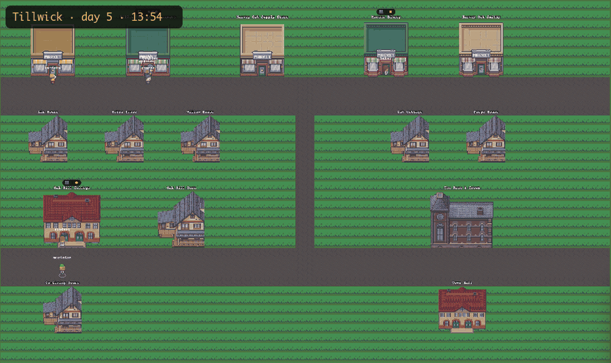

*The busiest stretch of a recorded live run (13:54 to 21:56 game time), played back by the replay
server at 7x. The game clock is at top left.*

**Tillwick is a small pixel-art town in which every resident is a separate, headless Claude session.**
The baker, barista, grocer, courier, smith, student, musician and the pub regular each run as their own
process. Each process is a Claude Agent SDK session on Haiku with a persona, a memory stream, a daily
plan, relationships and a testnet wallet. On every tick a citizen perceives the world, recalls what
matters, decides, and acts through a small set of world tools: walk somewhere, step inside, talk, bake,
or buy a coffee. A purchase is a real
[x402](https://www.x402.org/) payment: the buyer's wallet pays the shop owner's wallet in testnet USDC
on Base Sepolia, and the goods follow the transaction hash. A world server that never calls a model
keeps the map, the clock and the event ledger. A browser UI shows all of it: the town, building
interiors, conversations as speech bubbles, and each citizen's thoughts and tool calls.

The cognitive design follows *Generative Agents: Interactive Simulacra of Human Behavior*
(Park et al., UIST '23): memory retrieval by recency, importance and relevance, reflection, daily
planning, and turn-taking dialogue. Tillwick adds an economy, and every agent is a full
Claude Agent SDK session rather than a single prompt. It is built in TypeScript (Node 22) with Phaser 3 for the renderer.

> **Watch a recorded day with no LLM at all:** `npm install && npm run replay-server`, then open
> <http://localhost:4042>. The repo ships one real recorded run (see [Replay mode](#replay-mode-no-llm-no-wallets)).

## Gallery

| | |
|---|---|
| 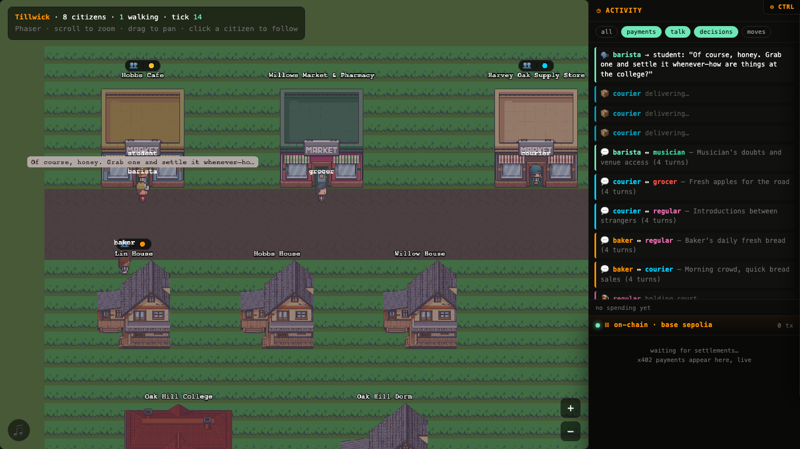 | 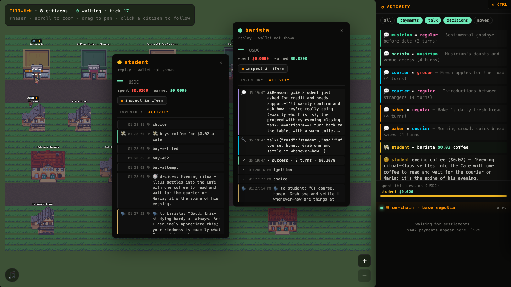 |
| **Street level.** Says and conversation turns show up as bubbles over the speakers, and the feed records them as they happen. | **Citizen cards.** Each card shows that agent's thoughts, tool calls and per-turn cost. Here the student's coffee purchase is traced through the x402 steps: decide → attempt → 402 → settled. |
| 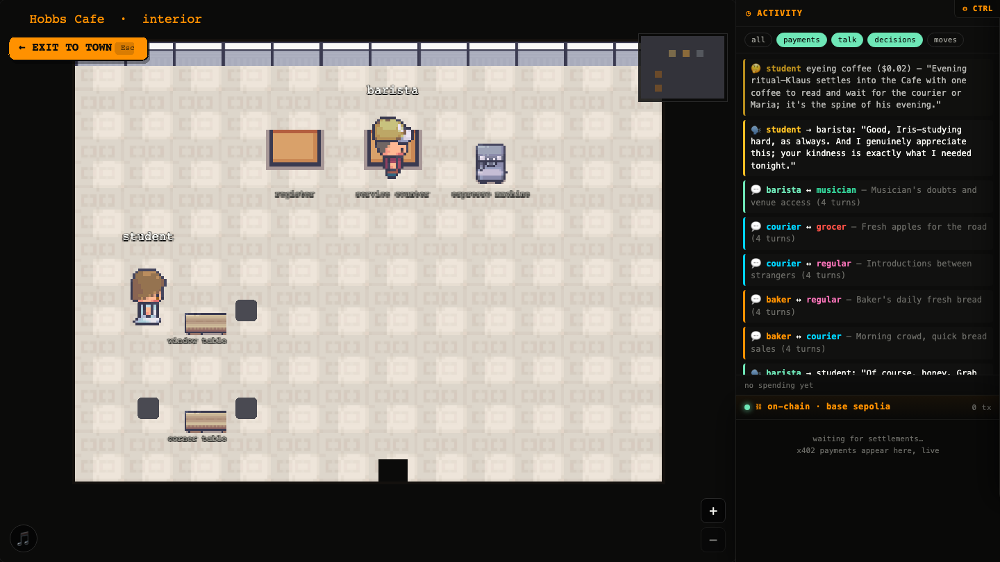 | 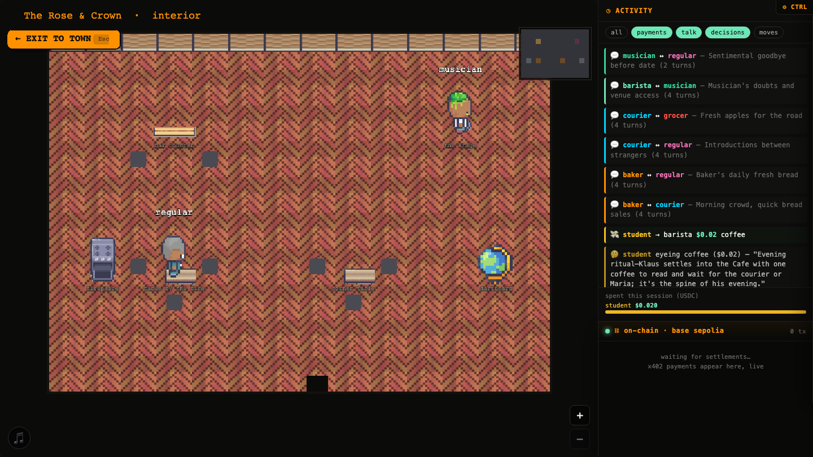 |
| **Interiors.** Click a building to go inside. Citizens stand at named stations: counter, tables, oven, stage. | **Evening at the pub.** The musician is on stage and the regular sits by the fire. Each interior has a minimap at top right. |
| 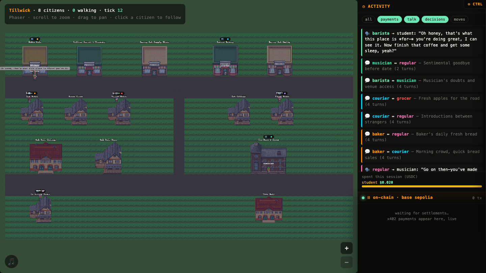 | 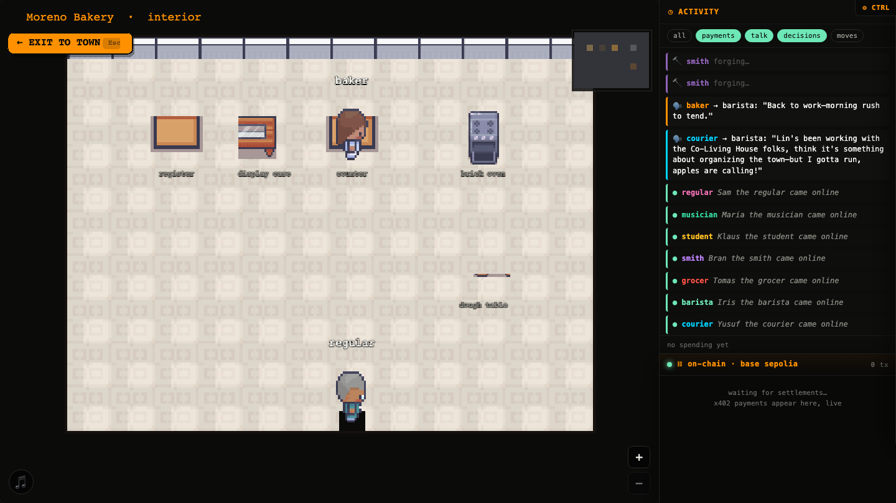 |
| **Night.** The light follows the game clock. By 23:00 most citizens have gone home. | **The bakery at noon.** A customer comes in while the baker works the counter. |

Main Street close up, from 10:25 to 17:00 game time in the same run, at 5x:

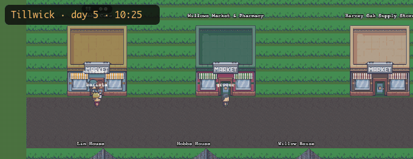

The screenshots use the LimeZu *Modern Interiors / Exteriors* pixel-art packs. These are paid and
**not included** (see [Assets](#assets)). Without them the same renderer draws its own
placeholder art:

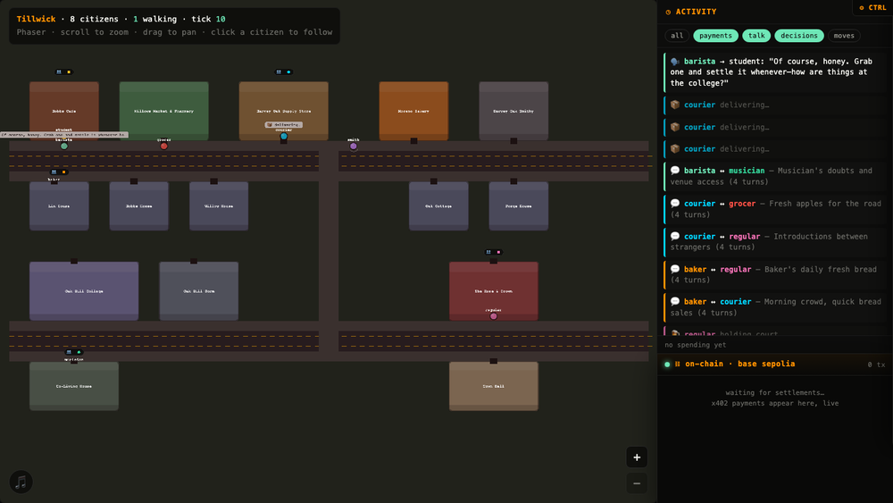

## How it works

### One citizen = one Claude session

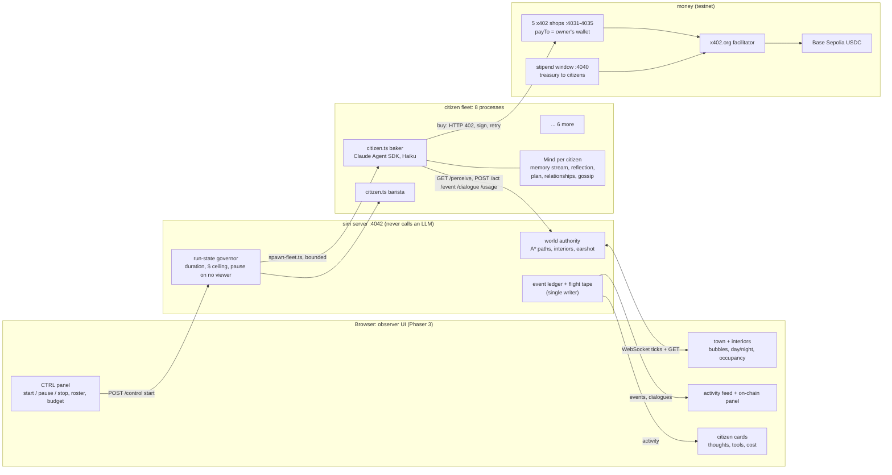

- **The sim** (`sim/sim-server.ts`) holds all world state. It owns the 64x38 tile map with 15
  buildings (9 have interiors), A* pathfinding, who is inside where, earshot (who overhears whom), the
  game clock (a 20-minute real-time day) and the run-state governor. It is the only writer of
  `events.jsonl` and the flight tape. It never calls a model.
- **A citizen** (`citizens/citizen.ts <id>`) is a long-lived Node process. Every tick it makes one
  Claude Agent SDK `query()` with the persona as the system prompt. The tool list is only the
  in-process `world` MCP server: `look`, `move`, `go_inside`, `talk`, `inventory`, `consume`,
  `evaluate_purchase`, `buy`, `give`, `pick_up`, `drop`, `use`, plus one role verb (`bake`, `brew`,
  `restock`, `deliver`, `forge`). Built-in tools are disabled, `settingSources: []` keeps the session
  hermetic, and `maxTurns` is 8. The model defaults to Haiku 4.5 and can be changed per citizen from the
  CTRL panel.
- **The Mind** (`cognition/`) is the Generative Agents part. It is a per-citizen memory stream on disk.
  Retrieval scores memories by recency, importance and relevance, using cosine similarity of local
  MiniLM embeddings from transformers.js on the CPU. It also handles reflection, a daily plan broken
  into time-located steps, a relationship graph, and gossip that carries its provenance chain.
  Schedules (`citizens/schedules.ts`) give each role a 24-hour arc. For example, the barista is at the
  café espresso machine during work hours.
- **Conversations** (`cognition/dialogue.ts`, `citizens/social-step.ts`): when two citizens are near
  each other, an ignition rule decides whether they start a conversation. The initiator's process
  generates a turn-taking dialogue in which each line is conditioned on that speaker's own summary
  and retrieved memories. The closed dialogue goes to `POST /dialogue`, and both citizens fold it into
  memory and their relationships. The renderer replays the transcript as alternating bubbles.

### One tick, including a purchase

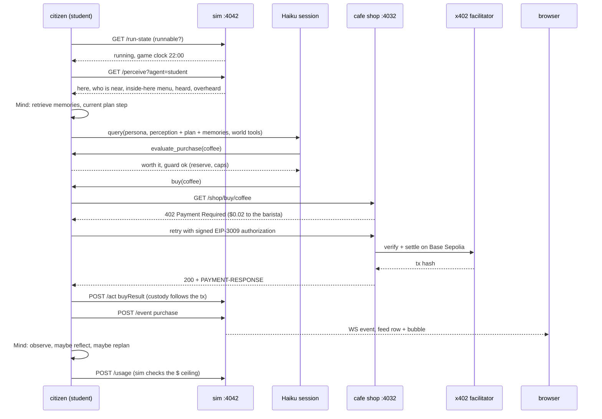

### The money

Every citizen has its own throwaway Base Sepolia wallet, and each process loads only its own key. The
five shops are x402 seller endpoints. Each one's `payTo` is its owner's wallet, so buying bread moves
USDC from the buyer to the baker, and the baker can spend it at the café. A treasury wallet funds the
town through a "stipend window", which is itself an x402 endpoint whose `payTo` is each citizen.
Funding is therefore gasless and needs only faucet USDC. A spending guard in code (`citizens/guard.ts`, configured in
`economy.config.json`) can veto any buy: a reserve floor of $0.02 to $0.05 per citizen and a $0.05
per-purchase cap. The daily cap is set to 1000 USDC, so in practice it never binds. That is
deliberate: the reserve floor is what stops a wallet from being drained. The model decides whether something is worth
buying, and the code decides whether it is allowed. Testnet only: this has never touched real funds.

## Results and measurements

The two charts below come from data in this repo and are regenerated with
`uv run docs/charts/make_charts.py`.

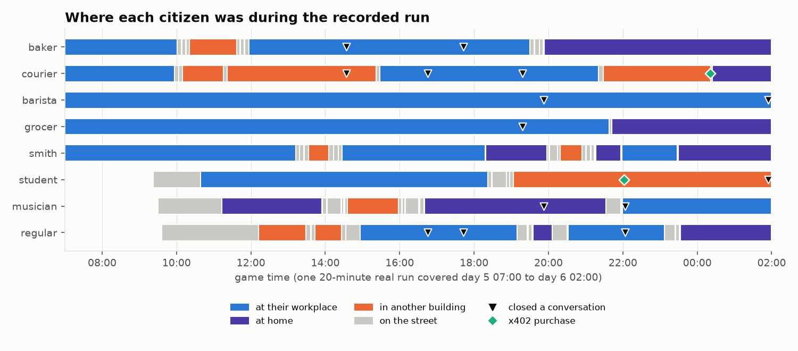

*Source: `samples/run-2026-07-18/tape.jsonl`, the flight tape of one live run on 2026-07-18 with all
eight citizens on Haiku 4.5.*

What that run shows, as recorded:
- **It covered a full waking day.** The run spanned game day 5 07:00 to day 6 02:00 in 15 min 54 s of
  real time. It was stopped by the **$5 per-run budget ceiling**: 50 citizen ticks came to $5.20 at
  API list prices (the run used the opt-in subscription login, so this was notional), a median of $0.095 per tick and a maximum of $0.28.
- **Producers kept to their schedules.** Baker, barista, grocer and smith spent most of the day at
  their workplaces and went home at night.
- **The town got crossed.** Citizens walked between the north and south halves of the map. Earlier
  builds treated those halves as two disconnected islands because of a walkability bug.
- **Seven real conversations** of 2 to 4 turns, plus two walk-bys.
- **Only two purchases.** The student bought a coffee at the café, and the courier bought bread at the
  bakery. Conversation got going in this run, but commerce stayed thin.

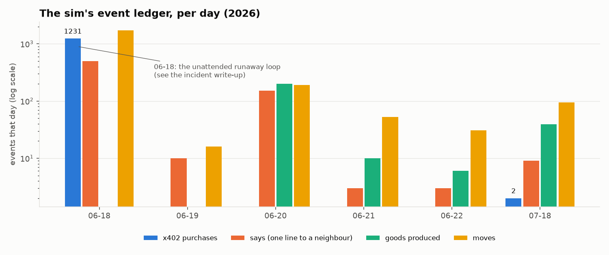

*Source: the sim's own event ledger, counted per day into `docs/charts/ledger-by-day.csv`. The raw
ledger is not shipped because its tx hashes point at the testnet wallets.*

Across all runs the ledger records **1,233 purchase events (1,166 distinct tx hashes)**. Nearly all of
them came from **one unattended day**. On 2026-06-17/18 the first five-citizen build ran in an
infinite loop for 18.5 hours, with no stop condition and no link to the browser. That amounted to
7,633 Claude conversations (ticks), about $195 at API list prices, on a personal subscription until it hit the plan's usage limit. The post-mortem
is in [docs/design/incident-2026-06-18-token-drain.md](docs/design/incident-2026-06-18-token-drain.md).
Its fix is the governor that every run now goes through: a mandatory duration, a per-run dollar
ceiling, pause when no browser is watching, max-tick and runtime backstops, and a circuit breaker.
The later runs are short, bounded and observed, so the busy bar is the runaway day and not the
design.

The sim also grades a run against an "is it alive?" scorecard (`npm run grade`). It covers map use,
schedule adherence, multi-turn conversations, the two-way ratio, relationship growth, located work
actions, interior occupancy and on-chain volume. `npm run replay -- --why <citizen>` explains from the
tape why a citizen did *not* do something.

## Replay mode (no LLM, no wallets)

`scripts/replay-server.ts` plays a flight tape back over the same WebSocket and HTTP routes the live sim
serves. The renderer, interiors, bubbles, day/night, feed and citizen cards (with recorded thoughts and
tool calls) all work. It spawns nothing, calls no model and touches no chain. `/control` and `/observe`
are refused.

```bash
npm install
npm run replay-server                                   # the bundled run, 8x
npm run replay-server -- --speed 20 --from 19:30 --loop
npm run replay-server -- --tape sim/data/runs/<runId>   # any run your own sim recorded
# open http://localhost:4042   (add ?art=limezu if you have the LimeZu packs installed)
```

The bundled sample (`samples/run-2026-07-18/`) is the run charted above, as recorded. Its two tx
hashes are redacted, and the cards show `replay · wallet not shown` with no balance.

## Running the live town

**Requirements**
- macOS or Linux with **Node 22** (developed on an Apple Silicon Mac). The citizens use no GPU. The
  embedding model (Xenova/all-MiniLM-L6-v2, about 90 MB) downloads on first use and runs on the CPU.
- **An Anthropic API key** in `.env` (`ANTHROPIC_API_KEY`), the documented way to authenticate the
  Agent SDK ([quickstart](https://code.claude.com/docs/en/agent-sdk/quickstart)). Every tick is a real,
  billed model call: the recorded run's 50 ticks cost $5.20 at API prices, and the per-run ceiling
  stops a run at $5 by default (`FLEET_CEILING_USD`).
- *Opt-in, for personal local experiments only:* your own logged-in Claude subscription instead of a
  key (`TILLWICK_USE_CLAUDE_LOGIN=1`, or `CLAUDE_CODE_OAUTH_TOKEN` from `claude setup-token`). This is
  how the project was developed. The dollar figures are then notional, and the runs count against your
  plan's usage limits.
- Testnet wallets: free Base Sepolia USDC from <https://faucet.circle.com>.
- Optional: the LimeZu art packs (paid). See `renderer/phaser/assets/README.md` for where to put them.

**Setup**
```bash
npm install
cp .env.example .env              # set ANTHROPIC_API_KEY and TREASURY_PRIVATE_KEY (a throwaway testnet wallet you funded)
npm run gen-citizens              # 8 citizen wallets -> citizens.local.json (gitignored; refuses to overwrite)
npm run stipend                   # terminal A: the stipend window on :4040
npm run fund-agents               # treasury -> each citizen, gasless, over x402
npm run sim                       # terminal B: the world on http://localhost:4042
```
Open <http://localhost:4042/?art=limezu> (or no `art` parameter for placeholders), open **CTRL**, pick
a duration and press **Start**. The sim launches `scripts/spawn-fleet.ts`, which starts the shops if
they are not running, staggers the citizens and tears them down when the run stops. Watch from the
feed and the cards, or with the zero-token tools: `npm run inspect -- <id>` (a citizen's mind),
`npm run trace -- <id> <tick>` (one decision end to end) and `npm run grade`. The repo's two Claude
Code skills, [`.claude/skills/run-town`](.claude/skills/run-town/SKILL.md) and
[`observe-citizens`](.claude/skills/observe-citizens/SKILL.md), cover driving and observing it from an
agent. After a run, `pgrep -fl 'citizens/citizen.ts|spawn-fleet'` should print nothing.

**Zero-token tests** (no model, no sim needed): `npx tsc --noEmit`, `npx tsx sim/perception.driver.ts`,
`npx tsx sim/world-tree.driver.ts`, `npx tsx scripts/verify-life-spine.ts` and
`npx tsx scripts/verify-flight-tape.ts`.

## Repo layout

```
sim/          world server, world.json (map, buildings, interiors), perception, earshot, run-state, flight tape, telemetry
citizens/     the citizen process, world tools, personas, schedules, social step (dialogue ignition), spend guard
cognition/    memory stream, retrieval, embeddings, reflection, planning, dialogue, relationships, gossip
economy/      custody of goods (tied to tx hashes) and the append-only ledger
shops/        the x402 shop servers and their registry; stipend-server.ts is the treasury window
renderer/     the browser UI: Phaser town and interior scenes, feed, cards, control panel, CC0 music
scripts/      fleet spawner, replay server, tape replayer and grader, inspectors, funding, verify-* tests
samples/      one recorded run for replay mode
docs/design/  architecture, economy, observability, experiment backlog, and the 2026-06-18 incident post-mortem
```

## Status and limitations

- This is a research toy, not a product. The longest graded runs are a single game day for eight
  citizens. Runs end on their duration or the $5 ceiling.
- Commerce stays thin once citizens are not stuck in a loop: the recorded day has two purchases. The
  pub has no payment rail for the musician's tips yet.
- Two defects were open when development paused. Run duration could overrun because the clock-jump
  interacts with how duration is measured, and in that case the budget ceiling is what stops the run.
  Also, a GUI Start and a manual fleet launch could race and double-spawn the fleet.
- Interior layouts are functional rather than pretty: furniture is not anchored to walls, and some
  pieces render squashed.
- A citizen's first tick takes 24 to 93 s while it builds its summary, plan and retrieval. On the map
  they often "produce in place", so the feed is livelier than the street.
- The "inspect in iTerm" button and `npm run observe` open terminal windows through AppleScript, so
  they work only on macOS.

## How it was built

Tillwick was built almost entirely by Claude Code agent teams. A lead agent planned waves of work,
used single-use teammates for each job, committed their work and graded every run from the sim's own
logs. Hence the instrumentation: the flight tape, the `--why` replayer and the scorecard. The sim's
rule of never calling a model, the run-state governor and the zero-token test drivers all came out of
that process and the incident above. The design notes in [docs/design/](docs/design/) are the cleaned-up
versions of what those agents worked from.

## Assets

| Asset | Where | Licence | In this repo? |
|---|---|---|---|
| LimeZu *Modern Exteriors* ([itch.io](https://limezu.itch.io/modernexteriors)) and *Modern Interiors* ([itch.io](https://limezu.itch.io/moderninteriors)) | town facades, ground tiles, citizen sprites, interior furniture in the screenshots | paid; use in your own projects, **no redistribution** | **No.** Buy the packs and install the crops into `renderer/phaser/assets/limezu/` (gitignored): `bash scripts/crop-interiors.sh` for the interiors, and the file-by-file layout in [renderer/phaser/assets/README.md](renderer/phaser/assets/README.md) for the rest. Then open `?art=limezu`. |
| Built-in placeholder art | everything, when `limezu/` is absent | drawn at runtime by the renderer (MIT, this repo) | yes (it is code) |
| Ten chiptune loops from OpenGameArt | the 🎵 button | CC0, each source page re-checked 2026-10-05 | yes: [renderer/assets/audio/CREDITS.md](renderer/assets/audio/CREDITS.md) |
| Phaser 3.90.0 | `renderer/phaser/vendor/phaser.min.js` | MIT ([notice](renderer/phaser/vendor/LICENSE)) | yes |

Screenshots and GIFs in this README show the LimeZu art as rendered by the running game. No LimeZu
files have ever been committed here.

## Credits and licences

- **Inspired by** *Generative Agents: Interactive Simulacra of Human Behavior*, Joon Sung Park,
  Joseph C. O'Brien, Carrie J. Cai, Meredith Ringel Morris, Percy Liang and Michael S. Bernstein,
  UIST '23 ([arXiv:2304.03442](https://arxiv.org/abs/2304.03442)). Tillwick contains no code from the
  paper's release. Several in-world names (Hobbs Cafe, Oak Hill College, Willows Market, Harvey Oak
  Supply, Moreno Bakery, The Rose & Crown, Johnson Park, Klaus, Maria, Sam) are a nod to the paper's
  town.
- **Phaser 3.90.0** (MIT, Richard Davey / Phaser Studio Inc., notice in renderer/phaser/vendor/LICENSE), **LimeZu** pixel art (not included) and the
  **CC0 music**: see [Assets](#assets).
- **Embeddings:** Xenova/all-MiniLM-L6-v2 through `@huggingface/transformers` (Apache-2.0), downloaded
  at runtime.
- **Runtime libraries:** `@anthropic-ai/claude-agent-sdk` (Anthropic's terms), `@x402/*` (Apache-2.0),
  viem, express, ws and zod (MIT). The full list is in `package-lock.json`.
- The in-world dialogue, thoughts and plans in `samples/` and in the screenshots are **AI-generated** by
  Claude Haiku 4.5 playing the citizens.

Code in this repo: [MIT](LICENSE).
